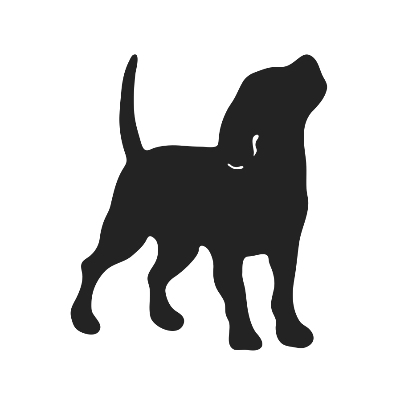

# Dog Coding Challenge



## Installation
1. Clone repository
```bash
$ git clone https://github.com/jyon124/DogCEO.git
```

2. cd into project directory
```bash
$ cd DogCEO/
```

3. Install all npm packages
```bash
$ npm install
```

4. Run npm development script
```bash
$ npm start
```

5. Browse to http://localhost:3000

## External API used
- https://dog.ceo/dog-api/documentation/

## Features
- Infinite Scroll (Continuously render additional dog images by scroll)
- Filter Dog Images by breed selection from the dropdown menu
- It won't display duplicate dog images
- Fully responsive
- Render amount of images change based on width or screen size
